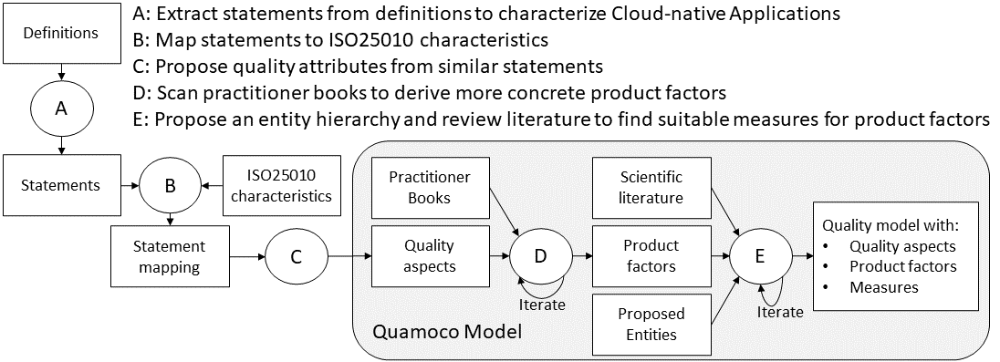
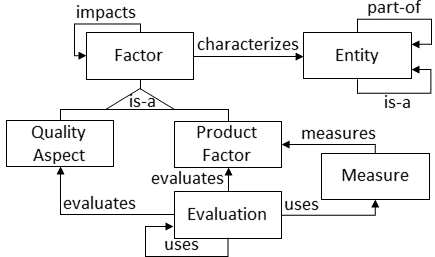

# Cloud-native applications Quality Model

This is the accompanying repository to the paper "Towards a Quality Model for Cloud-native applications".

Using the shown methodology, we have developed an initial quality model for cloud-native applications based on the [Quamoco meta model](https://mediatum.ub.tum.de/doc/1110600/file.pdf)

An excerpt of the [Quamoco meta model](https://mediatum.ub.tum.de/doc/1110600/file.pdf)

## A

[The raw statements from the definitions we used](A_raw%20statements.md)

[The quality aspects from the ISO25010 standard](A1_ISO25010%20quality%20aspects.md)

## B

[The statements from the CNA definitions mapped to suitable quality aspects](B_statements_mapping.md)

## C

[The initial quality aspects for the quality model](C_cna%20quality%20aspects.md)

## D

| Title                                                                                                                    | Author(s)                                                                                          | Year | Publisher |   |
|--------------------------------------------------------------------------------------------------------------------------|----------------------------------------------------------------------------------------------------|------|-----------|---|
| [Cloud Native Infrastructure](https://www.oreilly.com/library/view/cloud-native-infrastructure/9781491984291/)           | Justin Garrison and Kris Nova                                                                      | 2017 | O'Reilly  |   |
| [Cloud Native Java](https://www.oreilly.com/library/view/cloud-native-java/9781449374631/)                               | Kenny Bastani and Josh Long                                                                        | 2017 | O'Reilly  |   |
| [Cloud Native Patterns](https://www.manning.com/books/cloud-native-patterns)                                             | Cornelia Davis                                                                                     | 2019 | Manning   |   |
| [Cloud Native](https://www.oreilly.com/library/view/cloud-native/9781492053811/)                                         | Boris Scholl, Trent Swanson, and Peter Jausovec                                                    | 2019 | O'Reilly  |   |
| [Microservices Patterns](https://www.manning.com/books/microservices-patterns)                                           | Chris Richardson                                                                                   | 2019 | Manning   |   |
| [Cloud Native Transformation](https://www.oreilly.com/library/view/cloud-native-transformation/9781492048893/)           | Pini Reznik, Jamie Dobson, and Michelle Gienow                                                     | 2019 | O'Reilly  |   |
| [Cloud Native DevOps with Kubernetes](https://www.oreilly.com/library/view/cloud-native-devops/9781492040750/)           | John Arundel and Justin Domingus                                                                   | 2019 | O'Reilly  |   |
| [Kubernetes Patterns](https://www.oreilly.com/library/view/kubernetes-patterns/9781492050278/)                           | Bilgin Ibryam and Roland Huß                                                                       | 2020 | O'Reilly  |   |
| [Building Secure and Reliable Systems](https://www.oreilly.com/library/view/building-secure-and/9781492083115/)          | Heather Adkins, Betsy Beyer, Paul Blankinship, Piotr Lewandowski, Ana Oprea, and Adam Stubblefield | 2020 | O'Reilly  |   |
| [Design Patterns for Cloud Native Applications](https://www.oreilly.com/library/view/design-patterns-for/9781492090700/) | Kasun Indrasiri and Sriskandarajah Suhothayan                                                      | 2021 | O'Reilly  |   |
| [Practical Process Automation](https://www.oreilly.com/library/view/practical-process-automation/9781492061441/)         | Bernd Rücker                                                                                       | 2021 | O'Reilly  |   |
| [Cloud Native Architecture and Design](https://link.springer.com/book/10.1007/978-1-4842-7226-8)                         | Shivakumar Goniwada                                                                                | 2021 | Apress    |   |

[The initial product factors for the quality model](D1_product%20factors.md)

[The refined product factors for the quality model](D2_product%20factors.md)

## E

[The raw set of measures found through the literature seach](E1_raw_measures.md)

The process of searching the literature is described [here](literatureSearch/search.md).

[The set of measures selected as suitable for the quality model](E2_selected_measures.md)

[The quality model with measures added](E3_measures.md)

[The final quality model focused on the architectural design](E4_final_quality_model.md)

