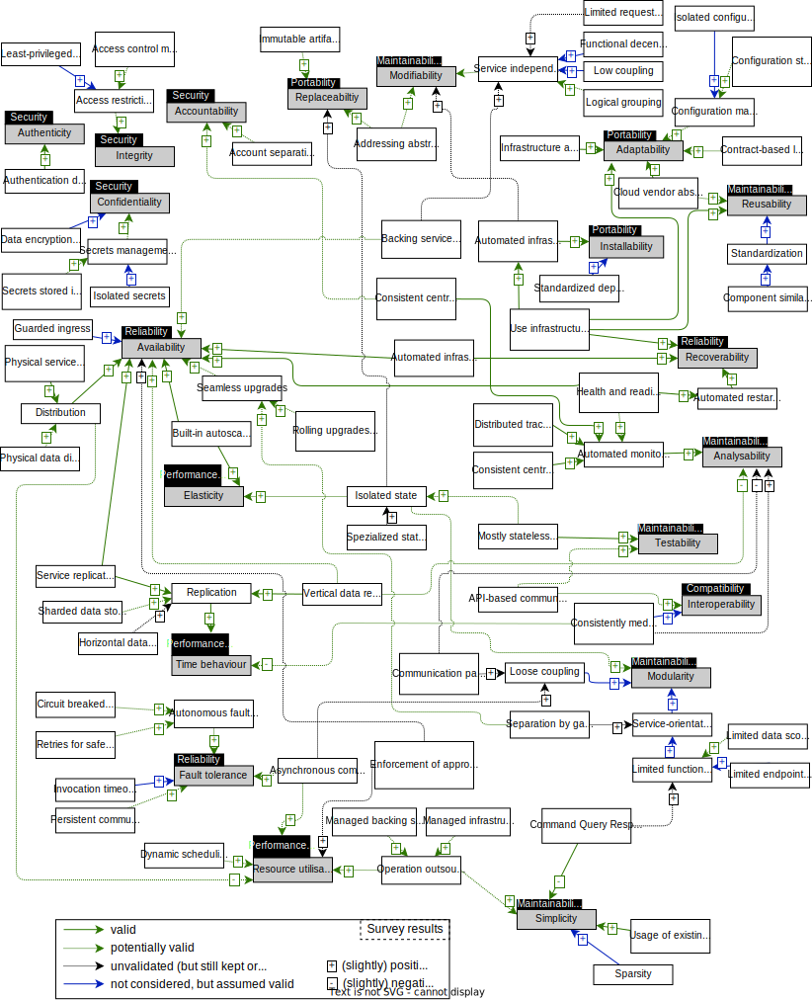
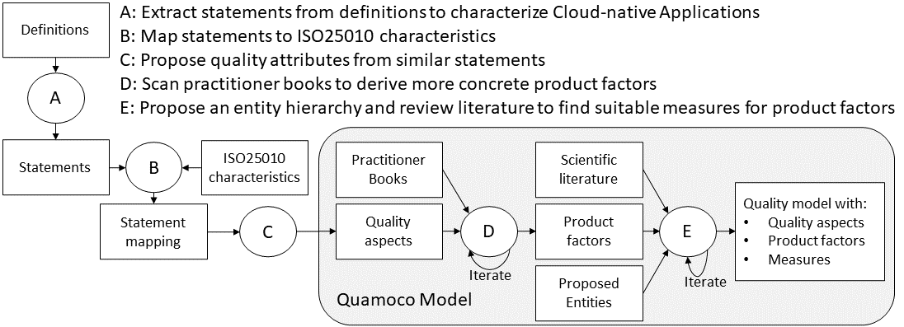
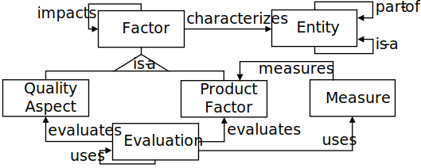

# Cloud-native Applications Quality Model

## Overview

This repository contains a quality model for cloud-native software architectures. The idea of the quality model is to enable quality evaluations for software architectures of cloud-native applications at design time. The quality model as such is based on the [Quamoco meta model](https://mediatum.ub.tum.de/doc/1110600/file.pdf) and this repository contains textual definitions and descriptions of the quality model elements. The quality model is still in development and details of the overall creation process are also included in this repository.

For a better overview (but essentially the same information) you can also have a look at the following site: [https://r0light.github.io/cna-quality-model/](https://r0light.github.io/cna-quality-model/).

If you came here from the paper "[Towards a Quality Model for Cloud-native applications](http://doi.org/10.1007/978-3-031-04718-3_7)", you can also have a look at [the state of this repository when that paper was published](https://github.com/r0light/cna-quality-model/tree/0.1)

Additionally, it is planned to provide tooling support for practically applying the quality model. This tooling is currently in development [here](https://github.com/r0light/cna-quality-tool).

## The Cloud-native Quality Model

The quality model is detailed in the file [quality-model.md](quality-model.md) and visualized like this:

## The Quality Model updated after the validation survey

To validate and revise the quality model a questionnaire-based survey has been conducted.

This happened using the following process.

### A: Preparation of the factors for the survey

Because of the large scope of the initial quality model, we filtered the factors to consider and prepared the survey as described in [A_factor_preparation.md](validation-survey/A_factor_preparation.md).

### B: Conducting the survey and results analysis

A more detailed report on the survey execution and results can be found in the repository [qmsurvey-results](https://github.com/r0light/qmsurvey-results)

### C: Updating the Quality Model based on the survey results

The changes applied to the quality model based on the survey results are described in [C_model_revision.md](validation-survey/C_model_revision.md).
The result of this revision of the quality model is the quality model as shown here:

## The initial Quality Model

The version of Quality Model as published in "[Towards a Quality Model for Cloud-native applications](http://doi.org/10.1007/978-3-031-04718-3_7)" is shown in the following with more details on the creation process.

The files containing the "raw" information are shortly described here:

The final quality as presented in the paper is described in the file [The final quality model focused on the architectural design](initial-creation/E4_final_quality_model.md) and is visualized like this:

## Details on the creation process and the files in this repository

We created this quality model by applying the following methodology:

The quality model is based on the [Quamoco meta model](https://mediatum.ub.tum.de/doc/1110600/file.pdf) and we defined **Quality aspects**, **product factors**, **entities**, and **measures** as described by this excerpt from the Quamoco meta model:

Referring to the methodology, in the following, details for the different steps (A,B,C,D,E) are presented.
For the visualizations of the diagrams we used: [https://app.diagrams.net/](https://app.diagrams.net/) and the `.drawio` files can be opened there.

### Step A

In the first step we extracted separate statements from the following definitions for cloud-native applications:

* [CNCF2018](definitions/raw/CNCF2018.md)
* [Fehling2014](definitions/raw/Fehling2014.md)
* [Gannon2017](definitions/raw/Gannon2017.md)
* [Kratzke2017](definitions/raw/Kratzke2017.md)
* [Pahl2018](definitions/raw/Pahl2018.md)
* [Pivotal2017](definitions/raw/Pivotal2017.md)
* [RedHat2018](definitions/raw/RedHat2018.md)
* [Toffetti2017](definitions/raw/Toffetti2017.md)
* [Wurster2020](definitions/raw/Wurster2020.md)

The extracted statements are listed in [A_raw statements.md](initial-creation/A_raw%20statements.md)

### Step B

In the second step we mapped the statements to the **quality aspects** of the [ISO25010 standard](https://iso25000.com/index.php/en/iso-25000-standards/iso-25010). A short summary of these aspects is given in [initial-creation/A1_ISO25010 quality aspects.md](initial-creation/A1_ISO25010%20quality%20aspects.md).

The mapping as the outcome of this step is presented here: [initial-creation/B_statements_mapping.md](initial-creation/B_statements_mapping.md)

### Step C

In the third step, we further differentiated the statements to derive **quality aspects** as required from the Quamoco meta model. These initial **quality aspects** with the statements they are based on are presented here:
[initial-creation/C_cna quality aspects.md](initial-creation/C_cna%20quality%20aspects.md) and visualized like this:

### Step D

In the forth step we defined more specific **product factors** which impact and realize the found **quality aspects**. Therefore we relied on the following practitioner books and mapped statements and chapters to the **quality aspects**:

| Title                                                                                                                    | Author(s)                                                                                          | Year | Publisher |   |
|--------------------------------------------------------------------------------------------------------------------------|----------------------------------------------------------------------------------------------------|------|-----------|---|
| [Cloud Native Infrastructure](https://www.oreilly.com/library/view/cloud-native-infrastructure/9781491984291/)           | Justin Garrison and Kris Nova                                                                      | 2017 | O'Reilly  |   |
| [Cloud Native Java](https://www.oreilly.com/library/view/cloud-native-java/9781449374631/)                               | Kenny Bastani and Josh Long                                                                        | 2017 | O'Reilly  |   |
| [Cloud Native Patterns](https://www.manning.com/books/cloud-native-patterns)                                             | Cornelia Davis                                                                                     | 2019 | Manning   |   |
| [Cloud Native](https://www.oreilly.com/library/view/cloud-native/9781492053811/)                                         | Boris Scholl, Trent Swanson, and Peter Jausovec                                                    | 2019 | O'Reilly  |   |
| [Microservices Patterns](https://www.manning.com/books/microservices-patterns)                                           | Chris Richardson                                                                                   | 2019 | Manning   |   |
| [Cloud Native Transformation](https://www.oreilly.com/library/view/cloud-native-transformation/9781492048893/)           | Pini Reznik, Jamie Dobson, and Michelle Gienow                                                     | 2019 | O'Reilly  |   |
| [Cloud Native DevOps with Kubernetes](https://www.oreilly.com/library/view/cloud-native-devops/9781492040750/)           | John Arundel and Justin Domingus                                                                   | 2019 | O'Reilly  |   |
| [Kubernetes Patterns](https://www.oreilly.com/library/view/kubernetes-patterns/9781492050278/)                           | Bilgin Ibryam and Roland Huß                                                                       | 2020 | O'Reilly  |   |
| [Building Secure and Reliable Systems](https://www.oreilly.com/library/view/building-secure-and/9781492083115/)          | Heather Adkins, Betsy Beyer, Paul Blankinship, Piotr Lewandowski, Ana Oprea, and Adam Stubblefield | 2020 | O'Reilly  |   |
| [Design Patterns for Cloud Native Applications](https://www.oreilly.com/library/view/design-patterns-for/9781492090700/) | Kasun Indrasiri and Sriskandarajah Suhothayan                                                      | 2021 | O'Reilly  |   |
| [Practical Process Automation](https://www.oreilly.com/library/view/practical-process-automation/9781492061441/)         | Bernd Rücker                                                                                       | 2021 | O'Reilly  |   |
| [Cloud Native Architecture and Design](https://link.springer.com/book/10.1007/978-1-4842-7226-8)                         | Shivakumar Goniwada                                                                                | 2021 | Apress    |   |

After the initial scanning of the practitioner books we had added the **product factors** as detailed in [initial-creation/D1_product factors.md](initial-creation/D1_product%20factors.md) and visualized like this:

After having read all books, we iterated on the found statements and refined the factor hierarchy. The outcome of this step is detailed in [initial-creation/D2_product factors.md](initial-creation/D2_product%20factors.md) and visualized like this:

### Step E

In the final step we added **measures** to the **product factors** as currently available in the scientific literature. This therefore serves as an evaluation of the currently existing **measures** which suit our model showing for which **product factors** **measures** have already been presented and for which **product factors** it is necessary to propose additional **measures** in future work (We do not propose additional **measures** in this work to keep the model in its current state aligned to existing literature).

But because **measures** need to be based on **entities** which form the software architecture, suitable **entities** are needed. Therefore we propose the following **entities** which can describe the software architecture of a cloud-native application as suitable for our quality model:

| Name                    | Description                                                                                              | Relation        |
|-------------------------|----------------------------------------------------------------------------------------------------------|-----------------|
| System                  | The cloud-native application as a whole                                                                  | -               |
| Component               | An abstract part of the system, maps to a logical service or cloud "resource"                            | part-of System  |
| Service                 | A service implementing a business functionality                                                          | is-a Component  |
| Endpoint                | A communication endpoint, for example a REST endpoint, message producer/listener                         | part-of Service |
| External Endpoint       | An endpoint which is publicly available                                                                  | is-a Endpoint   |
| Backing Service         | A component providing general functionalities needed by services, for example, messaging, logging        | is-a Component  |
| Storage Backing Service | An explicitly stateful component used to store business data, e.g., a database                           | is-a Component  |
| Link                    | A connection between components                                                                          | part-of System  |
| Infrastructure          | The technical foundation where components are deployed, e.g., a container orchestration system           | part-of System  |
| Deployment Mapping      | A connection between a component or infrastructure and its (underlying) infrastructure                   | part-of System  |
| Request Trace           | The whole resulting trace of a service invocation from the outside, a collection of components and links | part-of System  |
| Data Aggregate          | An aggregate which needs to be persisted and is used by services, e.g., Business objects                 | part-of System  |
| Backing Data            | Non-business data, e.g., config values, secrets, logs, metrics                                           | part-of System  |

To find suitable **measures**, we performed a literature search, as described in more detail in [literatureSearch/search.md](literatureSearch/search.md).

We first collected all **measures** that we found and characterized them, this is shown in [initial-creation/E1_raw_measures.md](initial-creation/E1_raw_measures.md).
Then we selected only those **measures** suitable for our quality model (that means a measure fits to a **product factor** of our quality model and is based on the same level of abstraction as defined by our proposed **entities**). The selected **measures** are shown in [initial-creation/E2_selected_measures.md](initial-creation/E2_selected_measures.md).

Next, we added these selected **measures** to our quality model which is detailed in [initial-creation/E3_measures.md](initial-creation/E3_measures.md) and visualized here:

It is important to note that up to this point our quality model has a broad scope also including aspects such as the deployment process (and fitting product factors) and runtime measures (shown in purple in the previous visualization). We deliberately included these things in our quality model to gather as much information as possible. However, because the focus of our quality model should be on the design time of a software architecture, we iterated on the quality model once more to only include aspects that can be evaluated at design time (therefore excluding runtime measures) and can be evaluated based on the entities that we have proposed (therefore excluding for example aspects considering the deployment process). It might be possible to reconsider these things in future work, but for now we want to focus on the design time and elaborate our quality model to enable quantitative evaluations of software architectures.

Our final quality model with this specific scope is detailed in [initial-creation/E4_final_quality_model.md](initial-creation/E4_final_quality_model.md) and visualized like this:

However, this visualization is problematic, because the relations between **factors** are difficult to see and follow. We therefore chose to change the visualization to a "star" form where the top most **quality aspects** are shown with a black background at the edges and **product factors** impacting multiple **quality aspects** can therefore be but in the middle. This is also the visualization shown initially:

